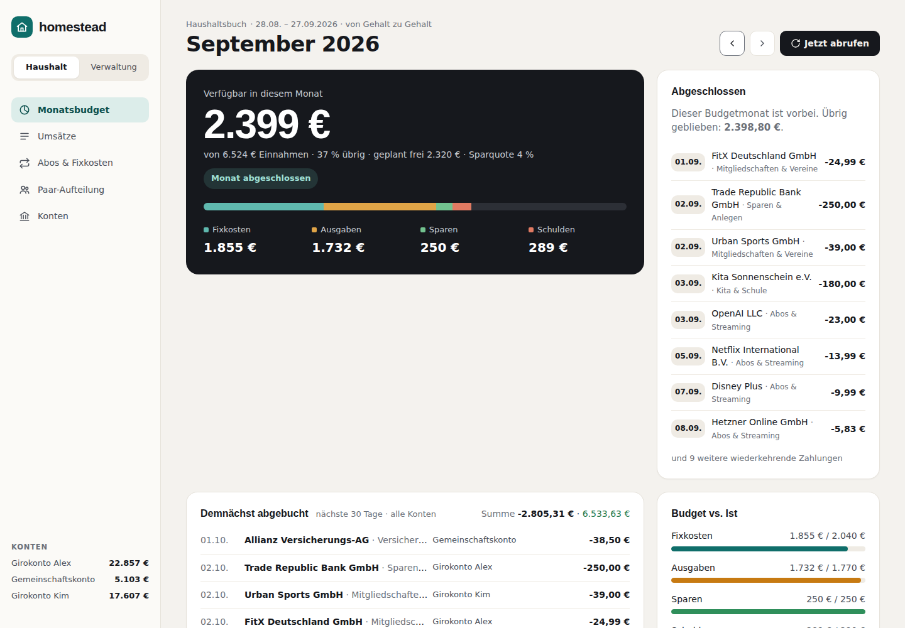
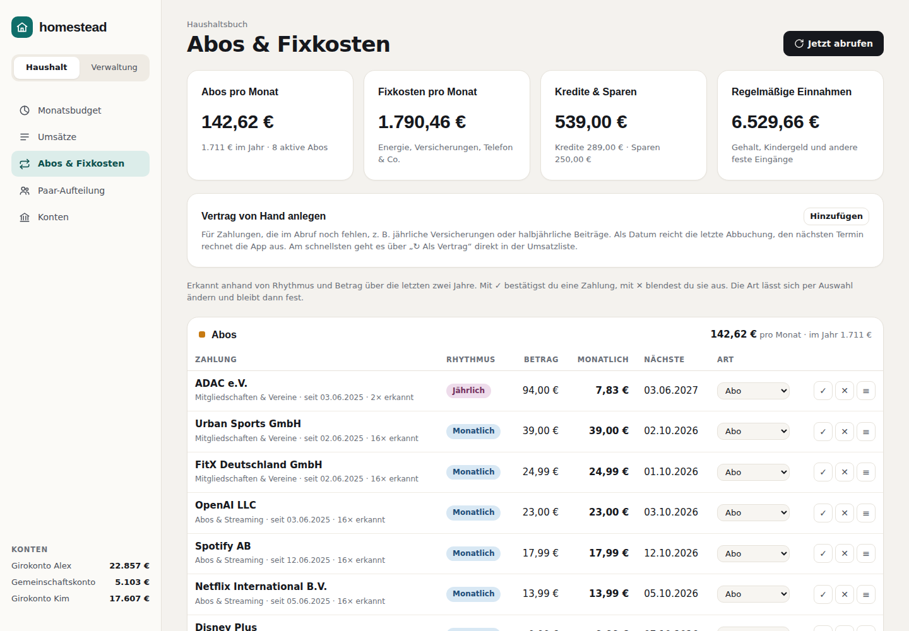
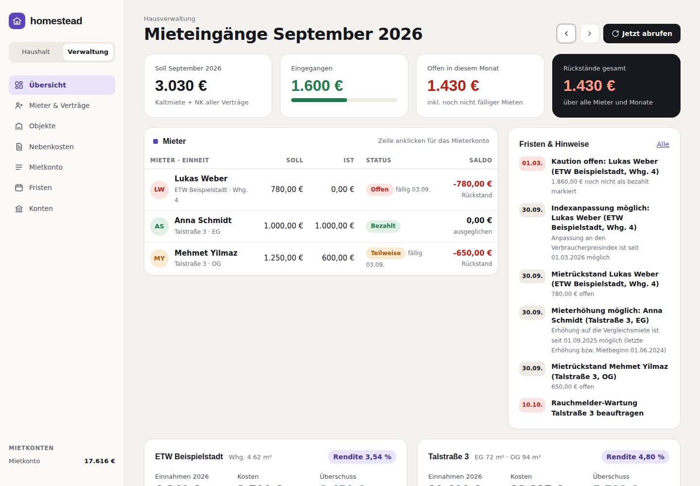
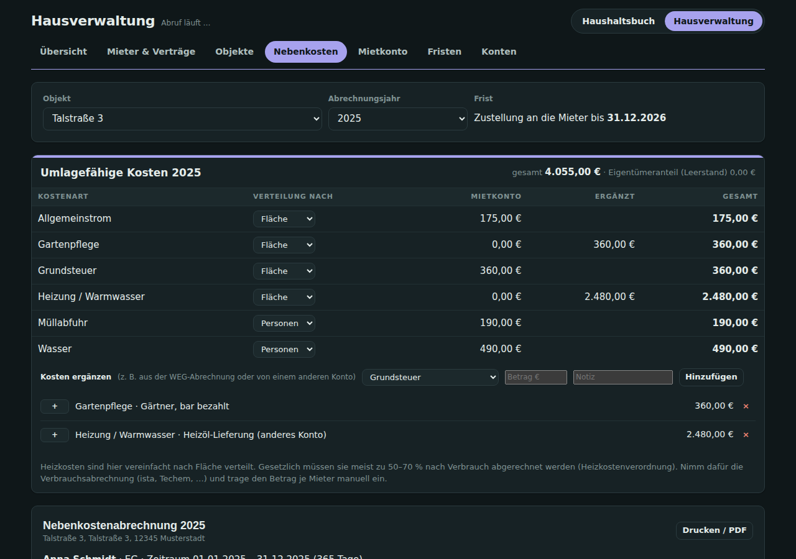

# homestead

**Self-hosted household budget and property management in one app.**

homestead pulls your bank accounts via **[Enable Banking](https://enablebanking.com/)** (PSD2, read-only), categorizes every transaction automatically and detects income, subscriptions, fixed costs, loans, savings and transfers between your own accounts. A second area manages rental properties: rent payments and arrears, property costs, utility cost settlements (Nebenkostenabrechnung) and legal deadlines.

The web interface is in **German** and follows German banking and tenancy conventions (SEPA, PSD2, BGB). Code and documentation are in English.

| Household budget | Subscriptions & fixed costs |
|---|---|
|  |  |
| **Property management** | **Utility cost settlement** |
|  |  |

## Features

**Haushaltsbuch (household budget)**
- **Budget month from payday to payday** with budget vs. actual per category, available amount, 12-month trend and a forecast until the next salary.
- **Upcoming debits** per account for the next 30 days, including the resulting balance.
- **Automatic categorization**: ~500 merchant patterns, PayPal/Klarna merchant extraction, keyword rules, your own rules ("assign all from this merchant").
- **Recurring payment detection** (weekly to yearly) for subscriptions, fixed costs, loans, savings and salary – with next due date and monthly equivalent.
- **Budget suggestions** from the 12-month average; budgets that no longer fit reality are flagged.
- **Couple split**: shared costs by income ratio vs. 50/50.
- **CSV import** for older history (Sparkasse, Volksbank, DKB, ING, Commerzbank, comdirect, …) and manual contracts for yearly payments.

**Hausverwaltung (property management)**
- Separate rent account(s), properties with units and floor area, tenants and leases (fixed, graduated or index rent).
- **Rent ledger**: payments matched by IBAN or name, oldest open rent first, arrears per tenant.
- **Property costs** automatically typed (property tax, water, waste, insurance, HOA fee, loan, repairs, …) and assigned to the property by address.
- **Annual report** per property with surplus and gross rental yield.
- **Utility cost settlement** by floor area, persons or units – printable per tenant.
- **Deadlines**: settlement due dates, possible rent increases (§ 558 BGB), index adjustments, graduated rent steps, lease end, open deposits, arrears, plus your own reminders.

Stack: Go (standard library + `lib/pq`), PostgreSQL, a static frontend without build step. One small container.

## Quick start (demo)

The demo mode uses a simulated bank and fills both areas with sample data – no bank account needed.

```bash
mkdir homestead && cd homestead
curl -fsSLO https://raw.githubusercontent.com/AQUI74S/homestead/main/docker-compose.yml
cat > .env <<EOF
POSTGRES_PASSWORD=$(openssl rand -hex 16)
HS_DEMO=true
EOF
docker compose up -d
```

Open https://localhost and accept the self-signed certificate once (or http://localhost:8080).

## Installation

### 1. Configuration

```bash
curl -fsSLO https://raw.githubusercontent.com/AQUI74S/homestead/main/docker-compose.yml
curl -fsSL -o .env https://raw.githubusercontent.com/AQUI74S/homestead/main/.env.example
```

Edit `.env` – it contains **every** setting, with comments. `docker-compose.yml` itself never needs to be edited.

| Variable | Meaning |
|---|---|
| `HS_DOMAIN` | host name you open the app with, e.g. `homestead.lan`; Caddy issues the certificate for it |
| `HS_PUBLIC_URL` | public URL (redirect target after the bank login); empty = `https://$HS_DOMAIN` |
| `HS_PASSWORD` | login password for the web UI; empty = no login (local testing only!) |
| `HS_SESSION_KEY` | random secret for login cookies, ≥ 32 characters (`openssl rand -hex 32`) |
| `HS_BANK_DAILY_LIMIT` | automatic bank requests per account and 24 h, default `4` (see below) |
| `HS_SYNC_INTERVAL` | minimum time between automatic syncs of an account, default `6h` |
| `HS_DEMO` | `true` = simulated bank with sample data |
| `EB_APP_ID` / `EB_COUNTRY` / `EB_API_BASE` | Enable Banking application ID, country for the bank list, API endpoint |
| `POSTGRES_USER` / `POSTGRES_PASSWORD` / `POSTGRES_DB` | database credentials |
| `HS_IMAGE` | image to run, default `ghcr.io/aqui74s/homestead:latest` |
| `HS_DATA_DIR` | directory for database, certificates and key, default `./data` |
| `HS_HTTP_PORT` / `HS_HTTPS_PORT` | ports published on the host, default `8080` / `443` |
| `HS_LAN_NETWORK` / `HS_LAN_IP` | optional own LAN IP, see below |

Settings with the old `HK_` prefix are still accepted by the app.

### 2. Enable Banking

Enable Banking is a licensed account information service. Access to **your own accounts** is free ("restricted production": the app only sees accounts you link yourself).

1. Create an account at https://enablebanking.com/ and open the Control Panel.
2. Create a new **application** in the **Production** environment:
   - Let the browser generate the key and save the `.pem` file as `data/secrets/enablebanking.pem`.
   - **Redirect URL:** `https://<your-host>/api/connections/callback` (exactly `HS_PUBLIC_URL` + `/api/connections/callback`). Only your browser needs to reach it – it does not have to be public.
   - **Privacy URL:** `https://<your-host>/datenschutz.html`, **Terms URL:** `https://<your-host>/nutzungsbedingungen.html` (both pages ship with the app).
3. Put the **application ID** into `.env` as `EB_APP_ID` and set `HS_DEMO=false`.
4. If required for restricted mode, link your own accounts to the application in the Control Panel.
5. `docker compose up -d`, then in the app go to **Konten → Bank verbinden**, pick your bank and confirm with login and TAN at the bank. Repeat for more banks – from the **Hausverwaltung** area for rent accounts.

Good to know:
- Bank consents last 90–180 days. The app reminds you 14 days before expiry; renewing takes one click and a TAN.
- **Request limits:** without you present, banks allow only a few requests per day and account (PSD2: usually 4, some banks fewer). One sync needs two requests (transactions and balance), so homestead syncs each account about every 12 hours. If a bank rejects a request because of its limit, the account pauses for 6 hours and homestead remembers the lower limit for that bank (shown under **Konten**). Clicking **Jetzt abrufen** sends your browser's details along (PSU headers), so these requests don't count towards the limit.
- On first sync the app tries to fetch 2 years of history; many banks only return 90 days. Use the CSV import for older data.

### 3. Run

```bash
docker compose up -d
```

`HS_DATA_DIR` (default `./data`) then contains everything worth backing up:

```
data/
├── db/        PostgreSQL data
├── caddy/     certificates (Caddy's internal CA)
└── secrets/   enablebanking.pem
```

The bundled Caddy container provides HTTPS with its own CA, because Enable Banking only accepts `https://` redirect URLs. Accept the certificate once, or trust Caddy's root certificate (`data/caddy/caddy/pki/authorities/local/root.crt`). If you already run a reverse proxy (Traefik, Nginx Proxy Manager, …), remove the `caddy` service and proxy to the app on port 8080.

### Own IP in the LAN (macvlan)

If ports 80/443/8080 are taken on the host (e.g. on a NAS) or you want a DNS name from Pi-hole, give homestead its own IP on an existing macvlan/ipvlan network. Set `HS_LAN_NETWORK` and `HS_LAN_IP` in `.env` and add the override file:

```bash
curl -fsSLO https://raw.githubusercontent.com/AQUI74S/homestead/main/docker-compose.static-ip.yml
docker compose -f docker-compose.yml -f docker-compose.static-ip.yml up -d
```

The override removes the published ports and attaches Caddy to the LAN network (requires Docker Compose ≥ 2.24).

### Portainer

Create the stack from the Git repository so updates arrive by themselves:

1. **Stacks → Add stack → Repository**, URL `https://github.com/AQUI74S/homestead`, reference `refs/heads/main`, compose path `docker-compose.yml`. For an own LAN IP add `docker-compose.static-ip.yml` as an *additional path*.
2. Under *Environment variables* choose **Load variables from .env file** and upload your `.env`. Set `HS_DATA_DIR` to an absolute path on the host (e.g. `/srv/homestead`) and put `enablebanking.pem` into its `secrets/` folder.
3. Optionally enable *GitOps updates* so Portainer redeploys when the compose files change; use *Pull latest image* on redeploy to get new images.

### Updates

Images are published to `ghcr.io/aqui74s/homestead`:

| Tag | Content |
|---|---|
| `latest` | current `main` branch |
| `1.2.3`, `1.2` | releases (git tags `v1.2.3`) |
| `sha-abc1234` | a specific commit |

```bash
docker compose pull && docker compose up -d
```

In Portainer: **Stacks → homestead → Update the stack** with *Re-pull image and redeploy*. Database migrations run automatically on start.

### Backup

```bash
docker compose exec -T db pg_dump -U homestead -Fc homestead > homestead.dump
# restore
docker compose exec -T db pg_restore -U homestead -d homestead --clean --if-exists < homestead.dump
```

## How categorization works

Order for every transaction (`internal/classify`):

1. A manually set category always wins.
2. Your own rules (created via "Alle von … so zuordnen").
3. Counter account is one of your own accounts → **transfer** (neither income nor expense). Between a rent account and a household account it becomes rental income or a subsidy.
4. Credits: keywords for salary, child benefit, refunds; a credit from a known merchant counts as a refund.
5. Debits: ~500 merchant patterns (supermarkets, fuel, streaming, insurance, utilities, …). For PayPal and Klarna the actual merchant is read from the remittance text.
6. Keywords in the remittance text (rent, loan, savings plan, installment, broadcasting fee, …).
7. **Recurrence detection**: same merchant, matching interval (7/14/30/61/91/182/365 days, one missed date allowed), stable amount (±20 %). Mixed merchants like Amazon are checked per amount cluster, so Prime is detected next to regular purchases.

New merchants can be added to `internal/classify/dictionary.go` – or simply via rules in the UI.

## Development

Requirements: Go 1.24, PostgreSQL 16 (or Docker).

```bash
go test ./...                                                  # unit tests
HS_TEST_DATABASE_URL=postgres://… go test ./internal/api/      # end-to-end tests against Postgres with the demo bank
HS_DEMO=true HS_DATABASE_URL=postgres://… go run ./cmd/homestead

# build and run the image locally
docker compose -f docker-compose.yml -f docker-compose.dev.yml up -d --build
```

Project layout:

```
cmd/homestead          entry point
internal/api           HTTP API (JSON, amounts in cents) and auth
internal/classify      categorization, merchant dictionary, recurrence detection
internal/csvimport     bank CSV import
internal/demo          demo data seeding
internal/enablebanking Enable Banking client and simulated demo bank
internal/forecast      forecast of recurring payments
internal/hv            property management: assignment, rent ledger, settlement, deadlines
internal/store         PostgreSQL access and migrations
internal/syncer        periodic bank sync
web                    static frontend (vanilla JS, embedded into the binary)
```

**CI/CD:** every push and pull request runs gofmt, `go vet`, the tests (with a Postgres service) and a JavaScript syntax check. Pushes to `main` and version tags build a multi-arch image (`linux/amd64`, `linux/arm64`) and push it to GHCR. Create a release with `git tag v1.0.0 && git push --tags`.

## Security

- The app never sees your banking credentials: login and TAN happen on your bank's page; the app only receives a time-limited, read-only consent.
- Account data stays in your own PostgreSQL database.
- Never commit `.env` or the Enable Banking key (`.gitignore` covers both).
- Run the app with a password and HTTPS whenever it is reachable beyond localhost.

## License

[MIT](LICENSE)
